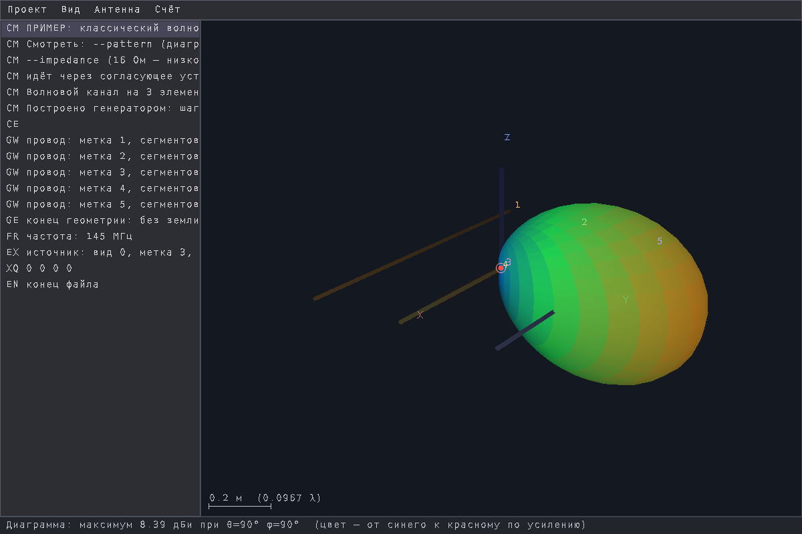
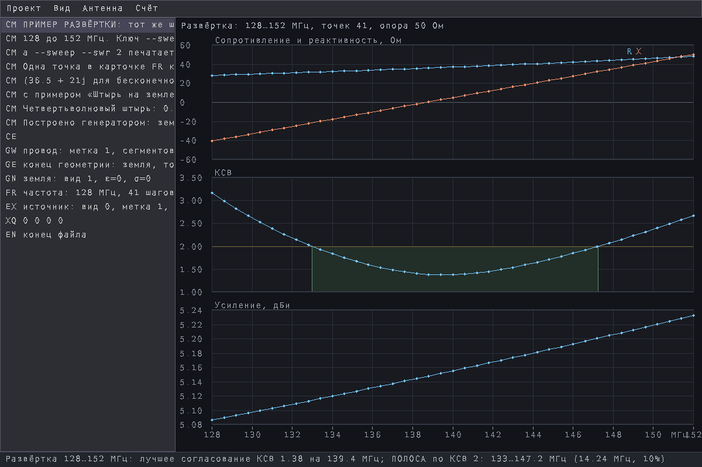
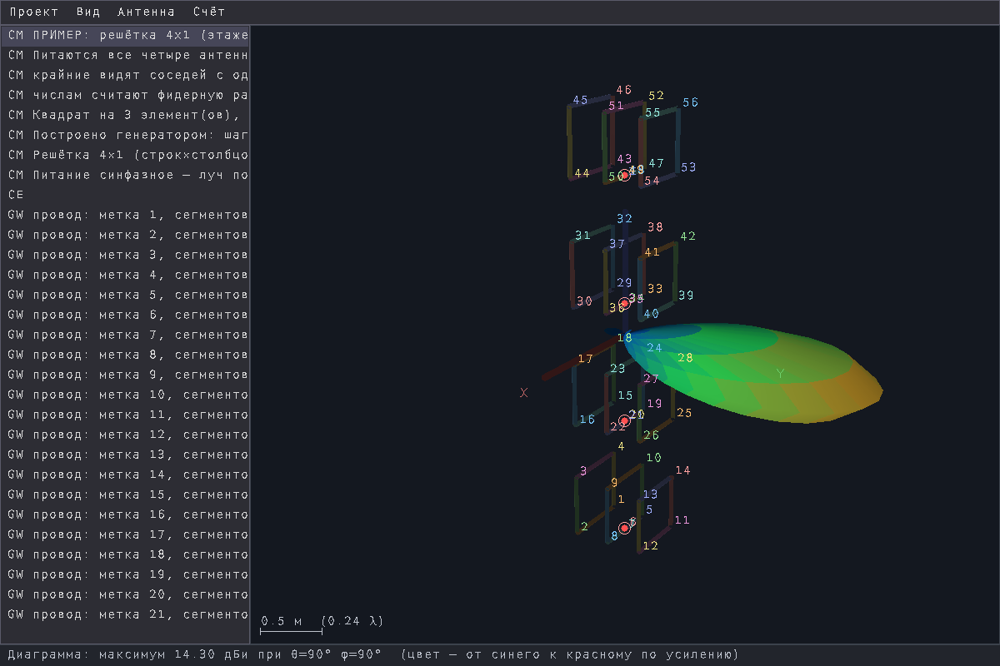

# EMzonar

**Проволочные антенны методом моментов.** Вы описываете антенну — файлом NEC
или просто замыслом, — а в ответ получаете числа и картинки: входной импеданс
и КСВ, токи по проводам, диаграмму направленности, полосу по частоте и то, что
наведёт на антенне приходящая волна.



Ядро — семейства NEC-2, написано с нуля на C++20; интерфейс свой. Над
настоящей землёй импеданс считается **точно**, интегралами Зоммерфельда — в том
числе у антенны, СТОЯЩЕЙ на грунте, где обычное приближение образом ломается.

| | |
|---|---|
|  |  |
| **Полоса числом.** `--sweep --swr 2` рисует R, X, КСВ и усиление по частоте и печатает, где КСВ не хуже порога: здесь 133…147 МГц, 10 % от середины. | **Решётки.** Строки и столбцы одинаковых антенн, питаются все; импеданс печатается для КАЖДОЙ — крайние видят соседей с одной стороны, средние с обеих. |

## Запуск

```sh
./emzonar                          пустое окно
./emzonar антенна.nec              окно: структура, карточки, состояние
./emzonar антенна.nec --check      провода, сегменты, габариты, частота
./emzonar антенна.nec --impedance  входной импеданс, КСВ, КПД
./emzonar антенна.nec --pattern    диаграмма направленности
./emzonar --generate вых.nec --kind yagi --elements 3 --freq 145 --wire 0.004
```

Нужен Linux x86-64 и SDL2. Рядом с бинарём должен лежать каталог `assets` —
из него берётся шрифт. Как всем этим пользоваться — **[Руководство.md](Руководство.md)**.

## Готовые антенны

В `Examples/` лежит 6 файлов: волновой канал, двойной квадрат, штырь над
идеальной землёй и он же СТОЯЩИЙ на настоящем грунте с радиалами, решётка 4×1 и
развёртка по частоте. У каждого в первых строках `CM` сказано, зачем он и на
что смотреть.

## Лицензия

MIT — [LICENSE](LICENSE). Канонический текст MIT говорит о «программе **и
сопутствующих файлах документации**», поэтому руководство, снимки и примеры —
на тех же условиях.

Всего 1,7M. Бинарь обрезан (`strip`), 1,4M.

Собрано 07.09.2026.
